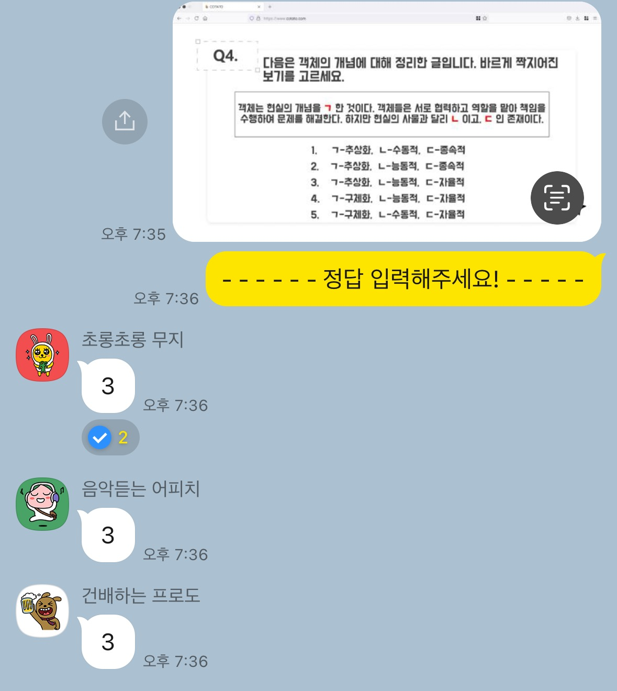
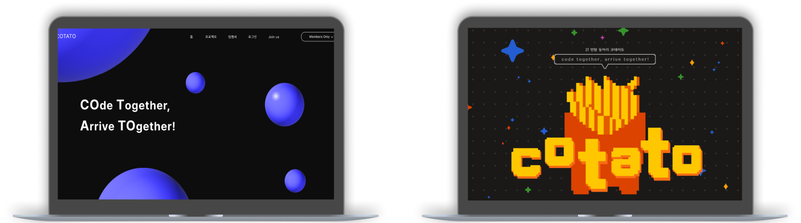
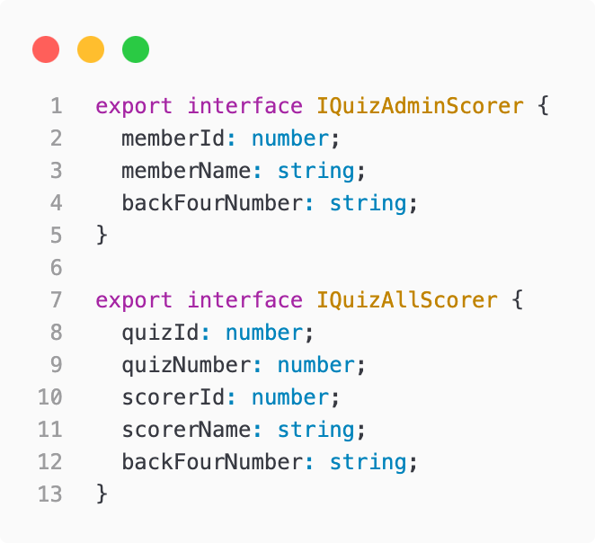
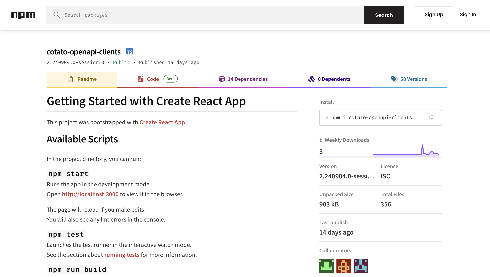
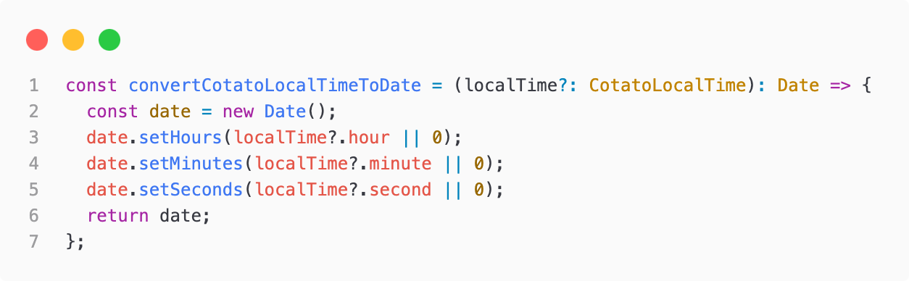
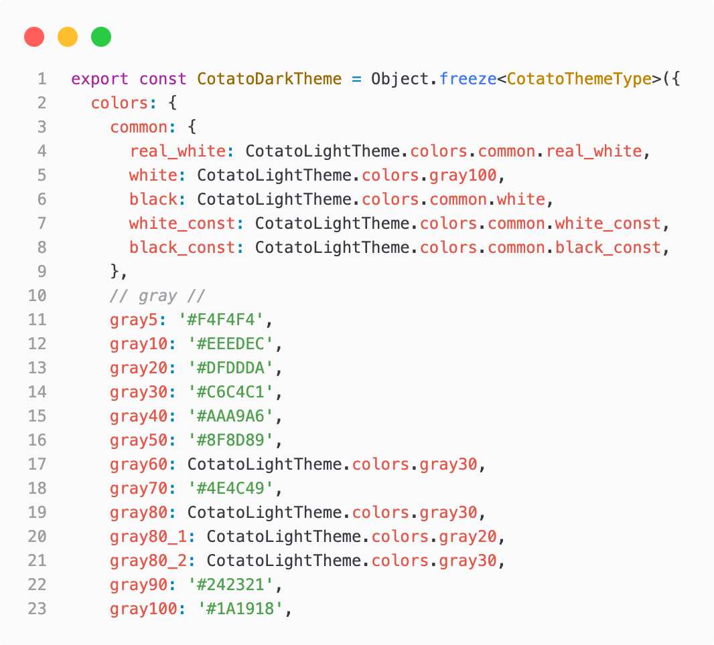
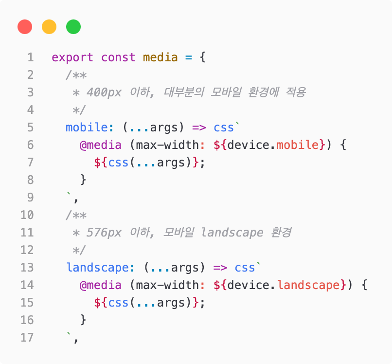
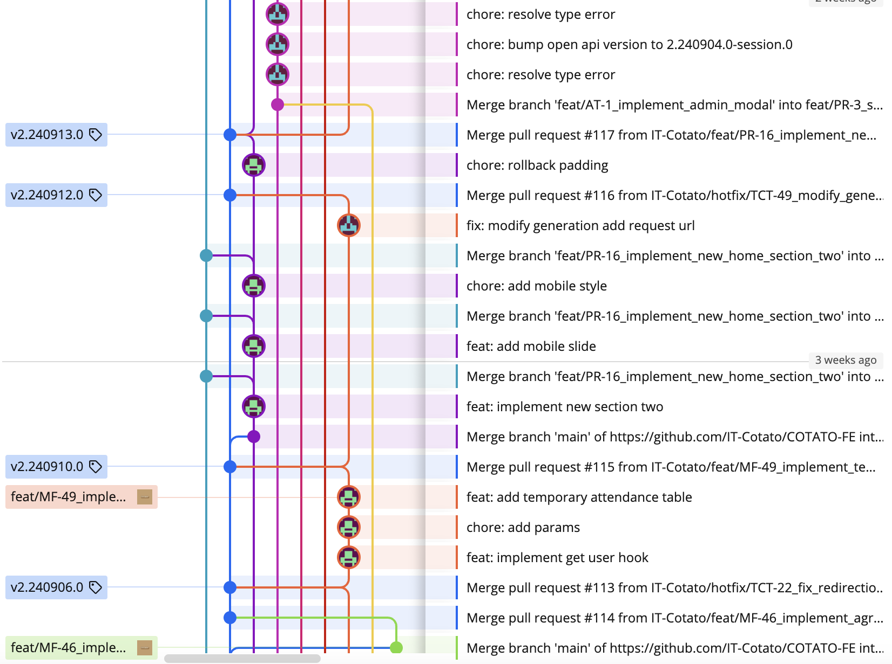
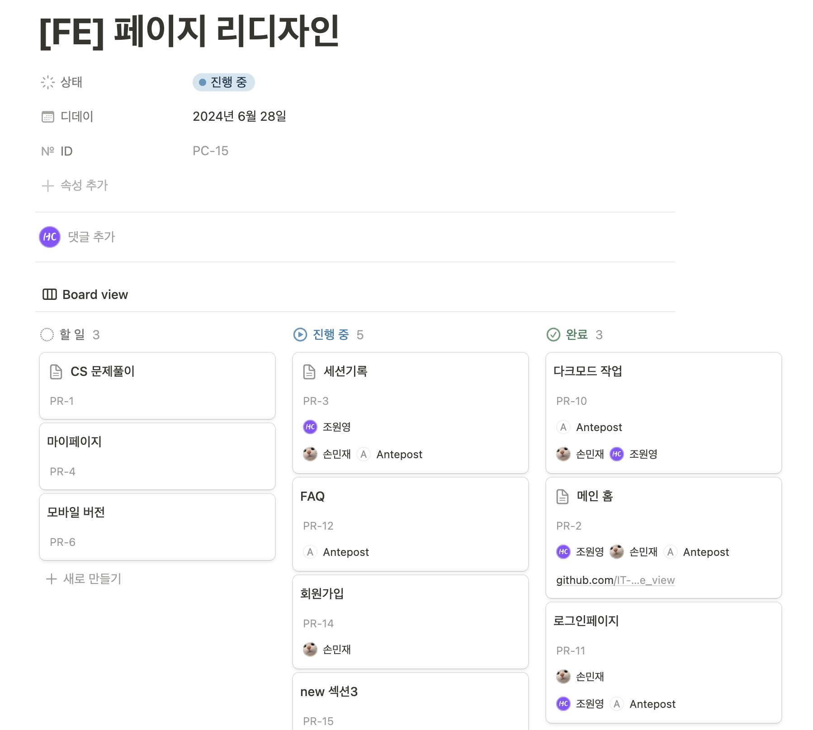

## 코테이토 프로젝트

코테이토 프로젝트는 IT 연합동아리 코테이토의 자체 사이트를 제작하는 프로젝트이다. 필자는 해당 프로젝트에서 프론트엔드 파트로 참여하고 있다. 프로젝트는 23년 9월, 코테이토 8기 프로젝트로 시작해서 현재까지 진행되고 있다. 버전은 23년 9월부터 24년 2월까지 V1, 24년 3월부터 8월까지 V2, 그리고 24년 9월부터는 V3를 시작하여 현재 새로운 버전을 준비하고 있다.

이번 회고록에서는 코테이토 프로젝트는 어떤 프로젝트인가와, 어떻게 프로젝트를 진행했는지에 대해 정리하는 글을 작성하고자 한다.

### CS 문제풀이 프로젝트 (V1)

코테이토 프로젝트의 시작은 동아리 활동에서 진행하는 CS교육을 위한 페이지였다. CS교육은 코테이토 교육팀에서 CS와 관련된 주제로 교육을 진행하고, 발표가 끝나면 10문제 가량 퀴즈를 다 같이 풀어보는 시간을 가진다.

기존에 퀴즈가 진행되는 방법은 카카오톡에서 이루어졌다.

위와 같이 카카오톡으로 문제를 올리고, "정답 입력해주세요!"라는 문구 이후에 가장 빨리 정답을 맞힌 사람이 득점을 하는 방식이였다. 이 방식에는 큰 문제점은 부원들이 참여율이 저조했다.

우선 문제의 난이도가 어려우면 본인이 제출하는 답안이 오답일수도 있다는 걱정 때문에 쉬운 문제에 비해서 제출하는 비율이 높지가 않았다. 그리고 퀴즈는 10문제중 가장 문제를 많이 맞히는 사람이 득점을 하는 방식인데, 문제 후반부로 가면서 이미 우승자가 결정되는 경우 부원들이 이미 우승을 포기하고 정답을 제출하지 않는 경우도 빈번했다.

카카오톡을 통해서 퀴즈를 진행하는 방식 자체가 원초적인 방식이고, 부원들의 참여를 높이기 위해서 자체 사이트를 통해 퀴즈를 진행하기 위해 CS 문제풀이 프로젝트를 시작했다.

V1기간인 8기때 사이트를 제작하고, 코테이토 9기부터 사이트를 통해 퀴즈를 진행한 결과 프로젝트의 기획 의도는 성공을 했다. 우선 내가 제출한 답안이 정답인지 오답인지 다른 사람이 알지 않고 나만 확인할 수 있기 때문에 부원들이 오답에 대한 걱정을 가지지 않고 제출을 했다. 그리고 득점 현황을 실시간으로 확인을 할 수 없으니 퀴즈 끝까지 부원들의 참여를 이끌 수 있었다.

### COTATO 프로젝트 (V2)

V1기간인 8기에는 퀴즈 문제풀이 페이지 제작을 위한 프로젝트였다면, V2기간인 9기에는 동아리 자체 사이트로 정체성을 가지고 홍보를 위한 프로젝트로 목표를 변경했다. 그 과정에서 기능적으로 크게 달라진 부분은 없지만, 사이트의 디자인 컨셉을 전면적으로 수정했다.

V2에서 새롭게 추가된 기능은 출석 기능이다. 코테이토 동아리는 매주 금요일에 정기 세션을 진행하는데, 이 때 부원들이 참석했는지 확인하기 위해 수기로 출석 체크를 진행한다. V2에서는 사이트에서 출석 기능을 추가하여 위치 기반으로 자동으로 출석 체크를 가능하게 했다.

V2에 들어와서는 출석을 제외하고는 기능이 크게 추가되지는 않았다. 하지만 9기에서는 사이트의 새로운 기능을 추가하는 작업과 더불어 현재 운영하고 있는 사이트를 관리하는 작업을 같이 했기에 출석 기능 추가 외에도 많은 작업 시간이 발생했다. 또한 페이지가 새롭게 디자인 되면서 이에 따라 기존 페이지의 코드도 전면 수정이 필요했다.

그리고 프로젝트를 진횅하는 방식이 V1과 많은 개선이 이루어졌다. V1때는 팀원들이 아직 프로젝트를 배우고 있던 시기였기에 단순한 방식으로 협업이 이루어졌다. 프로젝트의 규모가 커지게 되면서 기존 방식으로는 진행하기는 비효율적인 부분이 존재함을 느껴 협업 과정에서 체계화를 시키는 과정을 진행했다. 뒤에 나올 주제는 프론트엔드팀이 어떻게 협업 과정에서 체계화를 진행했는지에 대한 글이다.

## 프로젝트 개선 방식

### Type 관리

프로젝트 프론트엔드는 V1부터 타입스크립트를 사용해 진행했다. 하지만 당시 타입스크립트로 프로젝트를 진행하는건 모두 처음이였고, 스터디에서 배운 지식으로 프로젝트에 타입스크립트를 적용했다.

당시에는 타입이 필요하면 일일히 interface를 타이핑했다. 물론 당시에 타입스크립트에 대한 이해도는 너무나 없던 상태여서 왜 자바스크립트대신 타입스크립트를 사용해야 하는 이유를 직적 깨닫지는 못한 상태였고, 그저 타입과 관련된 에러가 발생하는 부분만 위와 같이 타이핑해서 타입스크립트를 사용했다. 위의 사진과 같이 interface를 정의하는 코드도 그저 db.ts라는 파일에 구분 없이 타이핑만 하는 파일이였다.

V2부터는 타입 관리를 체계적으로 하기 위해서 백엔드와 주고받는 api의 모든 request, response에 대해서 타입을 정의하기로 했다. 처음에 타입을 정의하는 두 가지 방법이 있었다. 하나는 api 명세서 기반으로 도메인별로 모든 타입을 직접 정의하것이고, Swagger의 OpenAPI Generator를 사용하는 방법이였다. 채택된 방법은 OpenAPI Generator이였고, 이는 좋은 선택이였음을 개발을 하면서 깨닫을 수 있었다.

Swager를 기반으로 타입을 자동으로 타입을 생성시키고, 이를 프로젝트에서 라이브러리로 사용하여 간편하게 백엔드에서 정의한 API의 request, response 타입들을 동기화 시킬 수 있었다. 따라서 백엔드에서 타입이나 변수명을 변경하는 경우 이를 명세서를 보며 일일히 코드의 변화점을 수정하지 않고 OpenAPI의 버전 관리를 통해 간편하게 타입과 변수명의 변화를 확인할 수 있었다.

타입을 자동으로 생성해주어 별도의 타입 정의없이 백엔드와 통신이 가능했지만 아직 개선의 여지는 남아 있었다.

위의 코드는 백엔드에서 사용하는 타입을 프론트엔드에서 그대로 사용하여 발생한 두 가지 문제를 해결하기 위한 함수이다. 우선 백엔드에서는 시간을 관리하기 위해 CotatoLocaTime객체를 사용고 있고, 이는 hour, minute, second라는 number형 필드를 가진다. api의 response 타입으로 백엔드에서 사용하는 CotatoLocalTime을 그대로 받고 있지만, 이를 프론트엔드에서는 Date객체로 사용이 필요했다. 그러기 위해서 CotatoLocalTime 타입을 Date 타입으로 변환시키는 함수가 필요했다. 또 다른 문제점은 converCotatoLocalTimeToDate함수의 인자인 localTime이 optional로 되어있다. 사실 로직상으로는 함수의 인자로 받는 localTime은 undefined 타입으로 반환받는 경우는 존재하지 않는다. 하지만 백엔드에서 Swagger 설정을 해주지 않는 이상 모든 타입은 optionaldl이 되어 위와 같이 불필요한 undefined에 대한 대처가 필요하다. 이는 백엔드와 계속된 논의와 로직상 필수로 값을 가지고 있는 경웨 대해서는 optional이 되지 않도록 하는 설정이 필요하다.

### 스타일링 관리

V1에서 개발을 하면서 CSS코드에서 색상을 사용하는 방법은 피그마에 있는 색상 코드를 직접 타이핑하는것이였다. 그렇다 보니 CSS코드에서 색상에 대한 정리가 전혀 되지 않았다. 즉 스타일과 관련된 문서화가 전혀 정리되지 않은 상태였다. 디자이너도 원하는 사용하고 싶은 색상을 그대로 적용하다 보니 라이트모드와 다크모드를 같이 구현하기에 복잡한 수준이였다. V2에서 스타일에 대한 정리를 하기 위해 우선 색상에 대한 정리를 시작했다. 디자인에서 color pallete를 문서로 정리해 프로젝트에서 사용하는 색상은 무조건 pallete에 있는 색으로만 적용을 하고, 라이트모드와 다크모드간에 색상 변환 테이블을 제작했다. 그래서 프론트엔드에서는 색상 코드를 그대로 사용하지 않고, 위의 코드같이 변수화된 색상을 사용하여 색상에 관련해서 디자인 파트와 동기화를 했다. 색상 코드를 변수로 타이핑하고 context API를 통해 전역적으로 사용할 수 있도록 하고, CSS-in-JS인 Styled Component를 통해 변수화된 색상을 사용했다.

스타일과 관련되어 통일한 부분은 색상 뿐만 아니라 기기별로 breakpoint를 정의해서 사용했다. V1에서 breakpoint에 대한 통일 없이 미디어쿼리에서 직접 픽셀값을 정의해서 사용했다. 그렇다 보니 각자 사용하는 breakpoint가 제각각이다 보니 반응형 작업이 페이지별로 다른 부분이 있었다. V2에서는 위와 같이 기기별로 픽셀값을 정의하고, Styled Component의 css함수를 통해 미디어 쿼리를 미리 정의해두어 기기별로 반응형 작업을 편리하게 했다.

색상과 breakpoint를 제외하면 아직 디자인 시스템으로 사용하고 있는 부분은 없다. 폰트 크기와 여백 크기도 현재 정리가 되어 있는 상태이지만, 이는 더욱 디테일한 크기를 적용하기 위해 현재 사용하고 있지는 않다. 그리고 현재 디자인 시스템과 관련하여 가장 정리가 필요한 부분은 아이콘 이미지와 관련한 부분이다. 디자이너가 사용하고 있는 아이콘들은 현재 피그마에서 svg파일로 그대로 다운받아 프론트엔드에서 사용하고 있다. 처음에는 크게 문제를 느끼지 못했지만, 프로젝트를 1년동안 진행하다 보니 이미지를 저장하는 assets 폴더에는 현재 200개가 훨씬 넘는 파일들이 있다. 이는 디자이너와 협의를 하여 프로젝트에서 사용하는 아이콘과 사진들을 사전에 정의하여 공통적으로 사용하는 방법을 강구하는것이 필요해 보인다.

### Git 관리

깃은 V1때부터 사용은 했지만, 당시에는 그저 코드를 보관하기 위한 기능이였다. 당시에는 브랜치도 각자의 깃허브 핸들명으로 지어 적당한 시기에 PR을 하는것이 전부였다. 그러다보니 깃의 기능 활용은 브랜치와 머지가 전부였다. 깃을 통해 코드를 더욱 체계적으로 관리하기 위해 Git flow를 V2에서 적용했다.

우선 CI/CD를 적용하여 main 브랜치에 코드를 push하면 자동으로 본 서버에 배포가 되도록 설정을 하고, 메인 브랜치 이후에 테스트를 위한 qa 서버를 신설하여 release 브랜치에 코드를 push하면 테스트 qa 서버에 코드가 배포되도록 했다. 그렇게 main과 release 브랜치는 배포를 위한 브랜치로 설정을 하고 새로운 작업은 feature 브랜치에서, 운영중인 서버에서 발생한 이슈에 대해서는 hotfix 브랜치에서 작업을 진행했다.

작어 브랜치는 위의 노션에서 정리한거와 '페이지 리디자인'이라는 대분류를 설정하고, '세션 기록'이라는 중분류를, 그리고 세선 분류에서는 페이지에 필요한 기능을 소분류로 정리하여 총 3개의 깊이가 되도록 설정했다. 그리고 분류 하나하나는 브랜치가 되어 소분류는 중분류에 merge하고, 중분류는 대분류에 merge, 그리고 대분류는 release에 merge시켜 qa서버에서 테스트를 진행하고 마지막으로 main에 merge시켜 본 서버에 배포하는 작업 흐름으로 구성했다.

위와 같은 방법으로 브랜치를 기능별로 사용하여 브랜치 관리를 체계적으로 진행했지만, 아쉬웠던 부분은 작업 단위를 알맞게 설정하지 못했다. 사진의 대분류는 '페이지 리디자인'이지만 위의 작업은 생각보다 너무 길게 진행이 되었다. 그러다보니 리디자인 작업 내용을 빠르게 배포하기 위해 모든 페이지가 리디자인 되지 않은 시점에서 본 서버에 배포하고, 브랜치가 삭제되지 않은 시점에서 계속해서 merge가 이루어졌다. 물론 대분류 브랜치는 배포가 되어야 하는 큰 단위의 작업이지만, 이렇게 브랜치의 단위를 설계하는것이 익숙하지 않다 보니 깔끔하게 단위를 설정하지 못한 부분이 있었다.

## V2에서 V3

코테이토 프로젝트를 진행하면서 일반적인 프로젝트와 다르게 많은 부분을 배울 수 있었다. V1기간에는 서비스를 제작을 했고, V2에서는 기존 서비스 운영과 운영중인 서비스에서 새로운 기능을 추가하는 기간을 거쳤다. V1에서는 단순히 프로젝트를 통해 구현하고 싶은 기능을 만드는거였지만, V2부터는 기능 추가를 복잡하게 하지 않기 위해 체계를 부여했다. V2에서 느낀거는 프로젝트를 성공적으로 하기 위해서는 체계를 갖추는것이 중요하다였다. V1에서 V2로 넘어가면서 체계를 위해 위에서 언급한 내용과 더불어 몇몇 시도를 했고, 그 결과는 아쉬웠던 부분도 있어지만 대부분 성공적이였다.

**그럼 V3에서 전환하면서 어떤 부분을 개선해야 할까??**

우선 V2에서 도입했지만 아쉬움이 있었던 부분들을 해결해아하고, 개인적인 목표로는 다른 팀원이 작성한 코드를 이해할 수 있는 체계를 갖추고 싶다. 프로젝트를 운영하면서 동아리 활동 직전에 이슈가 발생하면 시간이 가능한 사람이 빠르게 해결을 해야 하는 일들이 더러 발생했다. 하지만 아직은 남이 작성한 코드를 빠르게 이해하고 수정하기에는 어려움이 있었다. 또한 프로젝트가 점점 규모가 커지고 체계가 생기면서 다른 팀원이 만든 코드를 내가 직접 사용해야 하는 경우도 발생하지만 아직 그 코드를 이해하기까지는 시간이 걸린다.

이를 해결하기 위해서 크게 도입해야 하는것은 문서화와 코드리뷰 문화일 거 같다. 문서화는 공통적으로 사용해야 하는 코드들에 대한 ADT 작성이고, 코드리뷰는 다른 팀원이 작업을 할 떄 모든 팀원들이 코드의 흐름을 이해하기 위해 미리 파악하고 있어야 할 작업인 거 같다. 사실 코드리뷰는 V2에서 도입을 했지만 아직 코드리뷰를 하는 방법이 익숙하지 않아 리뷰가 서로 오고가지 못했다. V3에서는 기존의 개선점들을 수정하고, 다른 팀원이 작성한 코드에 대해서 이해할 수 있는 프로젝트를 만들고 싶다.

끝으로 이 프로젝트를 1년동안 같이 해준 모든 프로젝트 팀원들... 너무 고맙습니당❤️
