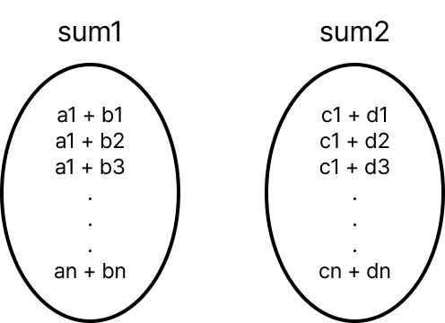

## Meet In The Middle Algorithm

**Meet In The Middle(MITM)** 을 한글로 직역하면 '**중간에서 만나기**'라고 해석할 수 있다. (백준 알고리즘 분류로는 중간에서 만나기라고 되어 있다.) MITM 알고리즘은 문제의 크기를 절반으로 나누어 해결하는 기법이다. Brute Force로 접근하여 문제를 해결이 불가능하게 n이 큰 경우 최적화하는 방법이다.

MITM은 문제를 두 부분으로 나누고, 각각의 부분 문제를 해결한 다음 다시 결합하는 방식이다. Divde and Conquer랑 비슷하게 보이지만, Divide and Conqeuer은 부분 문제를 쪼갤 수 없는 작은 크기로 문제를 나누고 이를 재귀적으로 병합하는 방법이지만, MITM은 문제를 두 부분으로 나누어 Brute Force 한 방식으로 해결하고 이를 조합하여 문제를 해결하는 방식으로 차이가 있다.

사실 여기까지 읽으면 무슨 소리인지는 잘 이해가 되지 않고... 백준에 있는 문제를 예시로 풀이를 하면서 알아보겠다.

## 문제 개요 및 Brute Force 방식

[https://www.acmicpc.net/problem/7453](https://www.acmicpc.net/problem/7453)

문제는 간단하다. 정수로 이루어진 배열 A, B, C, D가 있고, 각 배열에서 원소를 하나씩 뽑아(a, b, c, d) 이들의 합이 0(a + b + c + d = 0)이 되는 경우의 수를 구하는것이다.

Brtue Force 방식으로 문제를 접근하면, 만들 수 있는 모든 쌍을 만들어 계산을 해보는 것이다. a1 + b1 + c1 + c1 + d1, a1 + b1 + c1 + d2, a1 + b1 + c1 + d3,... , an + bn + cn + dn 이렇게 모든 쌍을 다 만들어 보는 것이다. 이 방식은 4중 반복문을 통해 코드로 표현할 수 있고, 다음과 같이 반복문으로 나타낼 수 있다.

```cpp
int n;
int arr[4][4010];
long long ans;

long long solve() {
    for (int i = 0; i < n; i++) {
        for (int j = 0; j < n; j++) {
            for (int k = 0; k < n; k++) {
                for (int l = 0; l < n; l++) {
                    if (arr[0][i] + arr[1][j] + arr[2][k] + arr[3][l] == 0) {
                        ans += 1;
                    }
                }
            }
        }
    }

    return ans;
}
```

이런 방식으로 계산을 하면 모든 덧셈쌍을 만들 수 있고, 합이 0이 되는 경우의 수를 구할 수 있다.

하지만 이는 복잡도가 O(n^4)이고, 문제에서 n의 최댓값은 4000이므로 계산을 하면 256 \* 10^12가 되어 시간 내에 문제를 해결할 수 없다.

## MITM 적용

위에서 MITM은 문제를 절반으로 나누어 해결한 다음 결합하는 방법이라 했다. Brute Force 방식으로 네 개의 배열의 모든 덧셈쌍을 구하면 복잡도가 O(n^4)이 되어 시간 내에 해결이 불가능하지만, **문제를 절반으로 나누어 생각해 보자.** 그럼 배열이 두 개를 가지고 모든 덧셈쌍을 구하면 O(n^2)이 되고, n의 최댓값인 4000으로 계산하면 16 \* 10^6으로 이는 시간 내에 충분히 풀이가 가능하다.

A, B 두 배열끼리 모든 덧셈쌍을 계산하고, C, D 두 배열끼리 모든 덧셈쌍들을 계산해서 저장해 둔다. A, B 배열의 덧셈쌍을 저장한 sum1과 C, D 배열의 덧셈쌍을 저장한 sum2 두 집합이 생긴다.



sum1의 원소와 sum2의 원소를 하나씩 뽑아 덧셈을 하면 A, B, C, D 배열들의 모든 덧셈쌍들이 나온다. (각 sum 집합의 원소 개수가 n^2이고, 두 집합을 조합하면 n^4개가 나온다.)

n^2개의 두 집합을 이중 반복문을 통해 모든 경우의 수를 구하면 이는 또 n^4의 복잡도가 나와 이 또한 시간내에 해결이 불가능하지만, 문제에서 요구하는 값은 모든 경우의 수에 대한 덧셈 결과가 아닌 합이 0이 되는 경우의 수이다.

이를 최적화하기 위해 sum2 집합을 정렬시킨다. 그리고 이중 반복문으로 모든 덧셈쌍을 구해 0이 되는지를 확인하는 것이 아니라 sum1에 대해서 반복문을 통해 sum1의 값에 반대되는 값이 sum2에 몇 개가 존재하는지 Binary Search를 통해 개수를 구한다. 이렇게 하면 하나의 반복문에서 합에 0이 되는 경우의 수를 모두 구할 수 있다.

```cpp
int n;
int arr[4][4010];
int sum1[4010 * 4010], sum2[4010 * 4010];
long long ans;

long long solve() {
    for (int i = 0; i < n; i++) {
        for (int j = 0; j < n; j++) {
            sum1[i * n + j] = arr[0][i] + arr[1][j];
            sum2[i * n + j] = arr[2][i] + arr[3][j];
        }
    }

    sort(sum2, sum2 + n * n);

    for (int i = 0; i < n * n; i++) {
        ans += upper_bound(sum2, sum2 + n * n, -sum1[i]) - lower_bound(sum2, sum2 + n * n, -sum1[i]);
    }

    return ans;
}
```

복잡도를 계산하면 첫 번째 이중 반복문은 n^2, sum2를 정렬하기 위한 시간 n^2 log(n^2), sum1에 대한 반복문에서 Binary Search를 하는 시간 n^2 log(n^2)이고, 이를 점근적 표기법으로 계산하면 O(n^2 + n^2 log(n^2) + n^2 log(n^2)) = n^2 log(n^2)이 된다. 복잡도가 n^2 log(n^2) 일 때 n의 최댓값 4000을 대입하면 192,000,000 정도가 되어 2억이 되긴 하지만 이는 충분히 도전해 볼 수 있는 숫자이다. 그리고 해당 방식으로 제출을 하면 8504ms의 시간으로 통과했다.

## 최종 코드

```cpp
#include <iostream>
#include <algorithm>

using namespace std;
using ll = long long;

int n;
int arr[4][4010];
int sum1[4010 * 4010], sum2[4010 * 4010];
ll ans;

int main() {
    ios::sync_with_stdio(false);
    cin.tie(nullptr);

    cin >> n;
    for (int i = 0; i < n; i++) {
        for (int j = 0; j < 4; j++) {
            cin >> arr[j][i];
        }
    }

    for (int i = 0; i < n; i++) {
        for (int j = 0; j < n; j++) {
            sum1[i * n + j] = arr[0][i] + arr[1][j];
            sum2[i * n + j] = arr[2][i] + arr[3][j];
        }
    }

    sort(sum2, sum2 + n * n);

    for (int i = 0; i < n * n; i++) {
        ans += upper_bound(sum2, sum2 + n * n, -sum1[i]) - lower_bound(sum2, sum2 + n * n, -sum1[i]);
    }

    cout << ans;
}
```

## 결론

이번 글에서는 Brute Force로 접근하는 경우 복잡도가 너무 크게 증가하는 경우 이를 최적화하기 위한 방법으로 MITM을 적용해 보았다. 자주 사용하는 알고리즘이지는 않은 거 같지만, 문제를 절반으로 나누어 해결하고 이를 조합하여 최적하는 방법이 재밌게 느껴졌다.

Brute Force를 사용해야 하는 문제인데 입력값이 너무 큰 경우 MITM을 적용을 고려해 보는 것도 좋은 접근방식일 거 같다.
